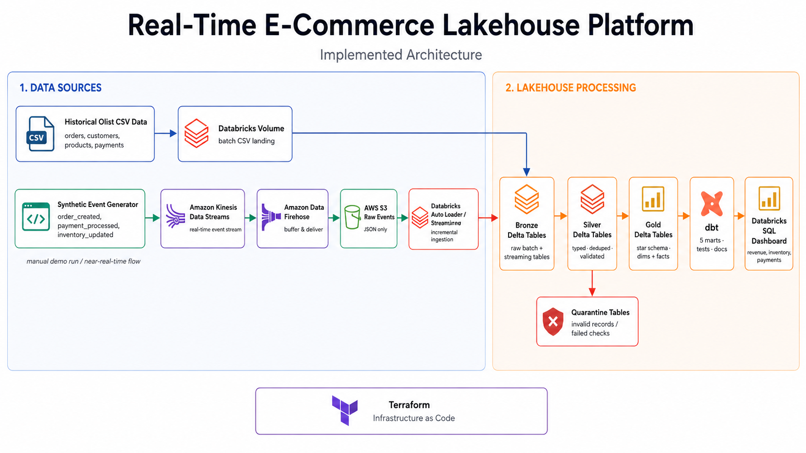
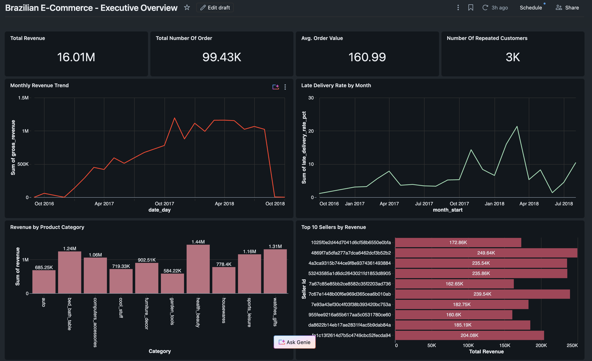
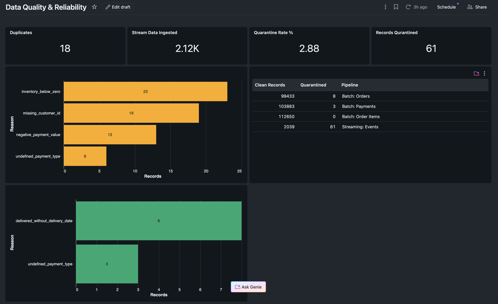

# Real-Time E-Commerce Lakehouse

An end-to-end **lakehouse platform** for Brazilian e-commerce data, built on the medallion architecture. It ingests both historical batch data and a simulated real-time event stream, enforces data quality with an explicit quarantine pattern, models a clean dimensional star schema, and serves analytics through dbt and BI dashboards.

Built on the [Olist Brazilian E-Commerce dataset](https://www.kaggle.com/datasets/olistbr/brazilian-ecommerce) (~100K orders, 2016–2018).



<p>
  
  
  
  
  
  
  
</p>

---

## What this project demonstrates

- **Dual ingestion** — historical CSVs loaded as batch, plus a synthetic event generator streaming through **AWS Kinesis → Firehose → S3**.
- **Medallion architecture** on **Delta Lake** — Bronze (raw), Silver (typed + validated), Gold (dimensional model).
- **Data quality as a first-class citizen** — every Silver transform validates its inputs and routes failing rows to a dedicated **quarantine** schema instead of silently dropping or crashing.
- **Dimensional modeling** — a conformed star schema with 4 dimensions and 2 fact tables at different grains.
- **Analytics engineering** — **dbt** builds business marts on top of Gold and tests referential integrity, uniqueness, and accepted values.
- **Infrastructure as Code** — the entire AWS streaming path is provisioned with **Terraform**.
- **BI** — Databricks SQL dashboards for both business metrics and pipeline reliability.

---

## Architecture

### 1. Ingestion

| Source | Path | Description |
|--------|------|-------------|
| Historical | CSV → Databricks Volume → Bronze | The 9 Olist tables loaded as batch. |
| Streaming | `generate_events.py` → Kinesis → Firehose → S3 | Synthetic `order_created` / `payment_processed` / `inventory_updated` events, seeded from **real** Olist IDs. |

The [event generator](data_generator/generate_events.py) supports a `--mode bad` flag that injects realistic defects (null foreign keys, negative payments, duplicate events, `not_defined` payment types) so the data-quality layer has something to catch.

### 2. Medallion processing ([databricks/e-commerce-workbook.ipynb](databricks/e-commerce-workbook.ipynb))

- **Bronze** — raw ingest, everything as strings, with `ingestion_timestamp` / `source_file` / `source_system` lineage columns. No schema inference (true raw layer).
- **Silver** — cast to real types, then **validate**. Each table builds an array of error reasons; clean rows flow to `ecom_silver`, failing rows to `ecom_quarantine` with the reason and an error timestamp. This layer also:
  - dedupes the 814 repeated `review_id`s (keeps latest),
  - collapses 1M geolocation rows to one representative coordinate per ZIP prefix,
  - fixes null product categories and the source's misspelled `lenght` columns,
  - aggregates payment lines to one row per order — the step that protects revenue from double-counting.
- **Gold** — a dimensional star schema (see below), built from the validated Silver tables.

### 3. Data quality & the quarantine pattern

Rather than letting bad data crash the pipeline or silently corrupt metrics, each Silver transform splits its output:

```
bronze → [type + validate] → clean rows → silver
                           └→ bad rows  → quarantine (with reason + timestamp)
```

Validation rules encoded in the pipeline include: missing keys, `delivered` status without a delivery date, `approved_before_purchase`, negative/zero prices, negative payments, and undefined payment types. Reconciliation counts (`clean + quarantine == source`) are asserted at every step.

### 4. Dimensional model


| Table | Type | Grain |
|-------|------|-------|
| `dim_customer` | dimension | one row per `customer_id` (carries `customer_unique_id` for person-level CLV) |
| `dim_seller` | dimension | one row per `seller_id` |
| `dim_product` | dimension | one row per `product_id` (with English category names) |
| `dim_date` | dimension | calendar spine over the order window |
| `fact_orders` | fact | one row per order — payment, item, and delivery measures |
| `fact_order_items` | fact | one row per order line item |

### 5. Serving layer ([ecom_lakehouse/](ecom_lakehouse/))

A **dbt** project builds business marts on top of the Gold tables and tests them:

| Mart | Question it answers |
|------|---------------------|
| `mart_daily_revenue` | Revenue, order count, AOV, and late deliveries by day. |
| `mart_customer_lifetime_value` | LTV and repeat-purchase behavior per unique customer. |
| `mart_product_performance` | Units, revenue, and avg price by product / category. |
| `mart_seller_performance` | Orders, revenue, and freight by seller and state. |
| `mart_fulfillment_performance` | Late-delivery rate and delivery time vs. estimate by month. |

dbt source tests enforce `not_null` / `unique` on primary keys, `accepted_values` on `order_status`, and `relationships` (orphan) checks across the facts and dimensions — the same integrity guarantees verified during profiling.

---

## Dashboards

**Executive Overview** — revenue trend, AOV, top sellers, and revenue by category.



**Data Quality & Reliability** — quarantine rate, defect reasons, and clean-vs-quarantined counts per pipeline.



---

## Tech stack

- **Compute / storage:** Databricks, Apache Spark (PySpark), Delta Lake, Unity Catalog
- **Analytics engineering:** dbt
- **Streaming / cloud:** AWS Kinesis, Kinesis Firehose, S3, IAM
- **Infrastructure as Code:** Terraform
- **Language / tooling:** Python, pandas, boto3

---

## Repository structure

```
.
├── architecture/          # architecture diagram + dimensional model
├── data_generator/        # synthetic event generator (Kinesis / local sinks)
├── databricks/            # medallion pipeline notebook (Bronze → Silver → Gold)
├── dashboards/            # BI dashboard screenshots
├── ecom_lakehouse/        # dbt project (Gold marts + tests)
├── notebooks/             # data profiling script
├── docs/                  # source data profile report
├── terraform/             # AWS streaming infrastructure (S3, Kinesis, Firehose, IAM)
└── data/raw/historical/   # Olist CSVs (git-ignored — download from Kaggle)
```

---

## Reproducing this project

> **Note:** The raw Olist CSVs are intentionally **not committed** (they're git-ignored). The repo showcases the code and architecture; download the data from Kaggle yourself.

1. **Get the data.** Download the [Olist Brazilian E-Commerce dataset](https://www.kaggle.com/datasets/olistbr/brazilian-ecommerce) and unzip the 9 CSVs into `data/raw/historical/`.

2. **Profile the data** (optional, but it's where the data-quality rules come from):
   ```bash
   python notebooks/01_profile_olist_data.py
   ```

3. **Provision the streaming infrastructure** (requires AWS credentials):
   ```bash
   cd terraform
   terraform init
   terraform apply
   ```

4. **Generate events** — locally to JSONL, or straight to Kinesis:
   ```bash
   # local file
   python data_generator/generate_events.py --events 1000 --mode bad

   # to the provisioned Kinesis stream
   python data_generator/generate_events.py --events 1000 --mode bad \
     --sink kinesis --stream ecom-lakehouse-events
   ```

5. **Run the medallion pipeline** — import `databricks/e-commerce-workbook.ipynb` into Databricks, point the `olist_raw` Volume at your CSVs, and run all cells to build Bronze → Silver → Gold.

6. **Build the marts:**
   ```bash
   cd ecom_lakehouse
   dbt run
   dbt test
   ```

---

## Selected results

From a representative run on the full Olist dataset:

- **R$ 16.01M** total revenue across **99.4K** orders (AOV **R$ 160.99**)
- **12.5 days** average delivery time
- **0 referential-integrity orphans** between facts and dimensions
- Data-quality layer quarantined **72 invalid records** across batch + streaming (orders, payments, events) with a **2.88%** streaming quarantine rate — each tagged with a machine-readable reason.
